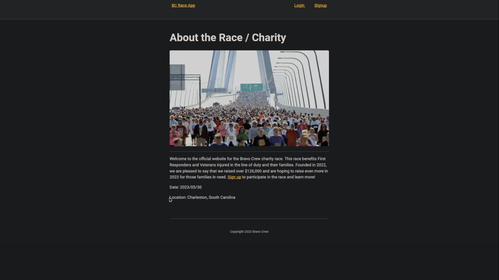
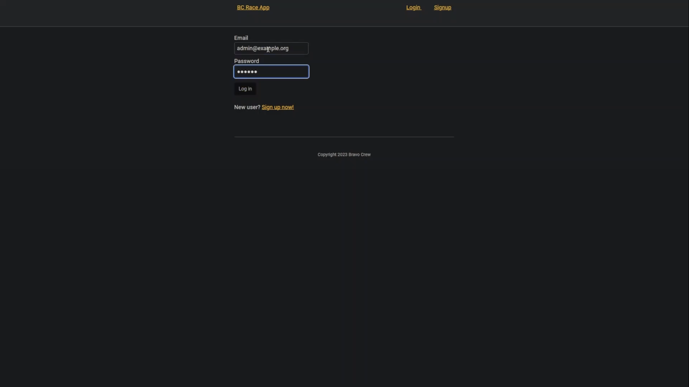
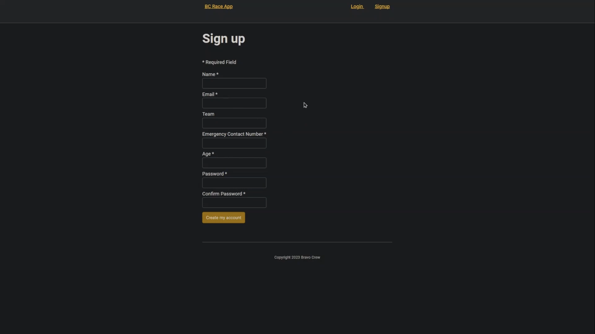
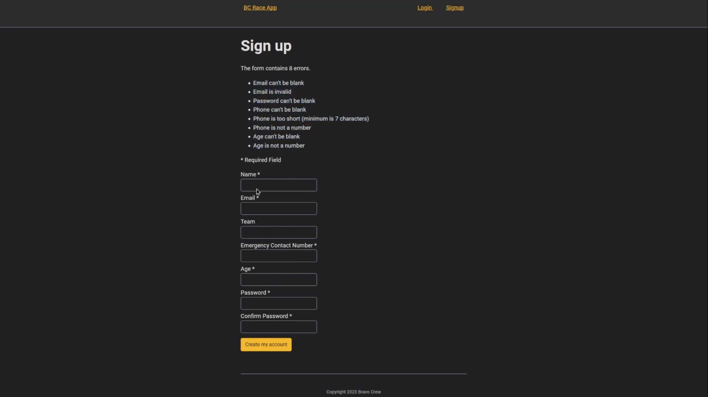
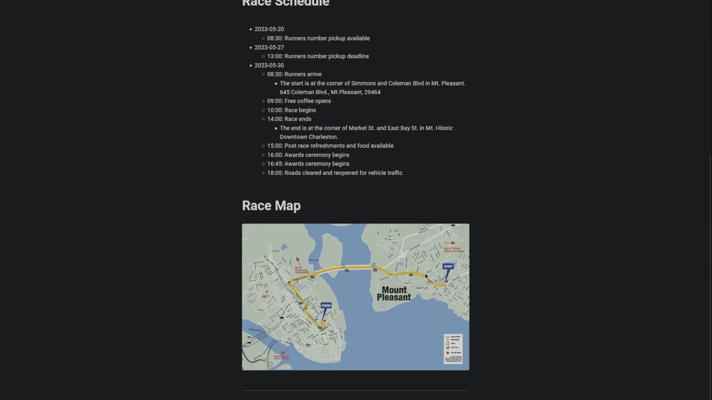
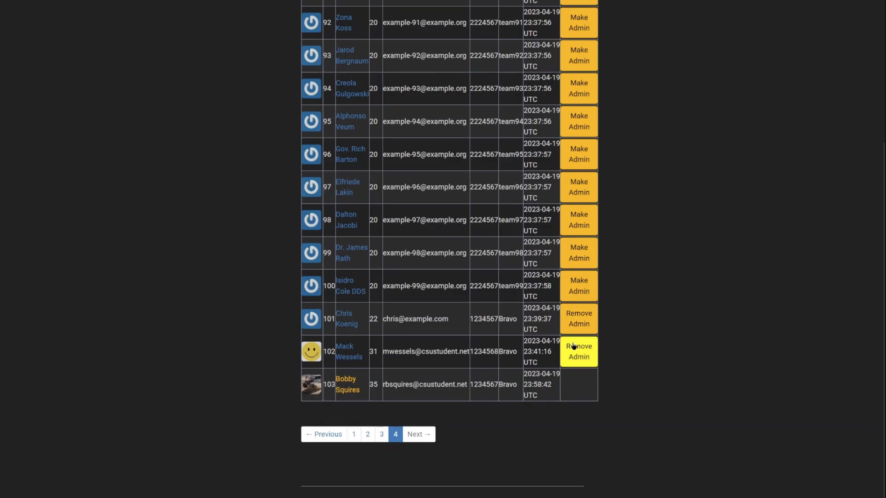

[Back to Portfolio](./)

5k Charity Run Website
===============

-   **Class:User-Interface Programming** 
-   **Group: Chris K., Mack W., Robert S.** 
-   **Grade:A** 
-   **Language(s):Ruby and Ruby on Rails** 
-   **Source Code Repository:** [features/mastering-markdown](https://github.com/rbsquires/BC_race_app.git/)  
    (Please [email me](mailto:mwessels@csustudent.net?subject=GitHub%20Access) to request access.)

    

## Project description

This charity run website was built with Ruby and Ruby on Rails. The owner of the charity wanted a website developed so that participants could sign up for the race, either individually or as part of a team. The client wanted all users to be greeted with a streamlined website that was easy to navigate and displayed all pertinant information to registered users. This included race events, locations and times. The owner also wanted certain individuals to be granted admin privileges for management purposes.

## How to compile and run the program

To get started, clone the repo and install the needed gems:
```bash
$ gem install bundler -v 2.3.14
$ bundle _2.3.14_ config set --local without 'production'
$ bundle _2.3.14_ install
```
Next, migrate to your the database to check any changes you have:
```bash
$ rails db:migrate
```

To seed your database for admin and other user testing:
```bash
$ rails db:seed
```

Next, you will point your repository to your Heroku application:
```bash
$ heroku git:remote -a YOUR HEROKU APP NAME
```

Then, you will push everything to your Heroku production site:
```bash
$ git push heroku
```

Finally, you will setup the production database on Heroku:
```bash
$ heroku run rails db:migrate
```

## UI Design

When a user loads the website, they are greeted by the Home page (see Fig 1). If the user is unregistered, they can click the Sign Up link in the description or at the top of the page. Alternatively, if already a registered user they can click the Login link and enter their credentials (see Fig 2).

  
Fig 1. Home page

  
Fig 2. Log In page

Once the new user has clicked the Sign Up link, they will be taken to the Sign Up page (see Fig 3). The user then fills out all required registration fields. If they have any errors in their entries, or left fields bank, they will be shown a list of the errors (see Fig 4).

  
Fig 3. Sign Up page

  
Fig 4. Sign Up page errors

After logging in or creating an account, the user will be taken to their Profile page. The profile page displays the user’s name, their team information (if applicable) and race schedule (see Fig 5). It also displays a map of the race route.

  
Fig 5. Profile page

  
Fig 6. Profile page


[Back to Portfolio](./)