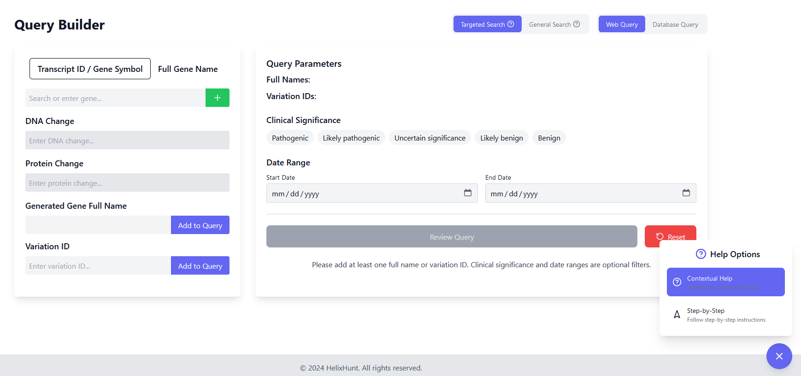
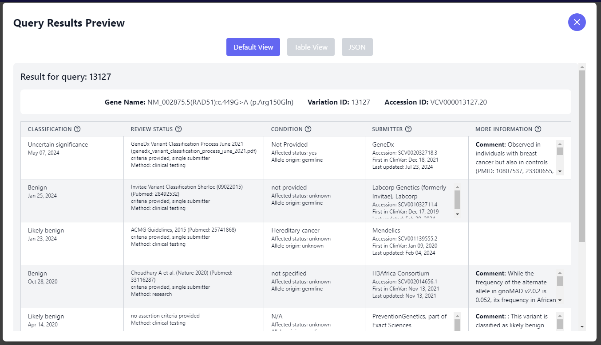

[Back to Portfolio](./)

HelixHunt
===============

-   **Class: Systems Analysis & Software Design** 
-   **Grade: A** 
-   **Language(s): Javascript, MySQL** 
-   **Source Code Repository:** [HelixHunt](https://github.com/csu-cs/CSCI-495-ClinVar-Project-GreenTeam)  
    (Please [email me](mailto:example@csustudent.net?subject=GitHub%20Access) to request access.)

## Project description

HelixHunt is a comprehensive web application designed to explore and analyze genetic variations with ease and efficiency. The platform provides a user-friendly interface for querying ClinVar data, supporting both targeted and general searches across genetic variations.

## UI Design

The Query Builder interface is crafted to make building genetic variation queries intuitive and efficient. The left side focuses on inputs, like Transcript ID or Gene Symbol, along with fields for DNA and Protein Changes. Users can add their selections smoothly, and the layout ensures that information is easy to manage.

On the right, users can review and refine their query with parameters like Clinical Significance and Date Range. Options to switch between different search modes provide flexibility, while clear buttons allow for reviewing or resetting the query. For extra support, a simple help menu offers guidance, making the interface approachable and user-friendly without overwhelming complexity.

  
Fig 1. The launch screen

  
Fig 2. The query builder.

  
Fig 3. Preview of the information to download.

## How to compile and run the program

1. **Clone the Repository**
```bash
git clone https://github.com/csu-cs/CSCI-495-ClinVar-Project-GreenTeam.git
cd helixhunt
```

2. **Install Dependencies**
```bash
# Install all dependencies
npm install
```

3. **Environment Setup**

Create a `.env` file in the root directory:
```env
# Server Configuration
PORT=5001
NODE_ENV=development

# Database Configuration
DB_HOST=localhost
DB_USER=your_mysql_username
DB_PASSWORD=your_mysql_password
DB_NAME=helixhunt

# JWT Configuration
JWT_SECRET=your_jwt_secret_key

# SendGrid Configuration
SENDGRID_API_KEY=your_sendgrid_api_key
SENDGRID_FROM_EMAIL=your_verified_sender_email
NOTIFICATION_EMAIL=your_notification_email
```

### Generating JWT Secret Key

For security, you should use a strong, random JWT secret key. Here are several ways to generate one:

#### Option 1: Using Node.js
```bash
node -e "console.log(require('crypto').randomBytes(64).toString('hex'))"
```

#### Option 2: Using OpenSSL
```bash
openssl rand -hex 64
```

#### Option 3: Using Python
```bash
python -c "import secrets; print(secrets.token_hex(64))"
```

Copy the generated string and use it as your `JWT_SECRET` in the `.env` file.

#### Important Security Notes
- **Never share or commit your JWT secret**
- **Environment Separation**: Use a different secret key for each environment (development, staging, production)
- **Key Length**: Make your secret at least 64 characters long
- **Key Rotation**: Consider rotating the secret periodically in production environments


4. **Database Setup**
```bash
# Log into MySQL
mysql -u root -p

# Create database
CREATE DATABASE helixhunt;

# Create user and grant privileges
CREATE USER 'helixhunt_user'@'localhost' IDENTIFIED BY 'your_password';
GRANT ALL PRIVILEGES ON helixhunt.* TO 'helixhunt_user'@'localhost';
FLUSH PRIVILEGES;
```

Run database migrations:
```bash
node server/config/migrations.js
```

5. **Initial Data Load**
```bash
# Run the test sequence to load initial data
node server/services/fileService/initialDataLoad.js
```

## Getting Started with Create React App

This project was bootstrapped with [Create React App](https://github.com/facebook/create-react-app).

### Available Scripts

In the project directory, you can run:

#### `npm start`

Runs the app in the development mode.\
Open [http://localhost:3000](http://localhost:3000) to view it in your browser.

The page will reload when you make changes.\
You may also see any lint errors in the console.

#### `npm test`

Launches the test runner in the interactive watch mode.\
See the section about [running tests](https://facebook.github.io/create-react-app/docs/running-tests) for more information.

#### `npm run build`

Builds the app for production to the `build` folder.\
It correctly bundles React in production mode and optimizes the build for the best performance.

The build is minified and the filenames include the hashes.\
Your app is ready to be deployed!

#### `npm run dev`

Runs both the frontend and backend servers concurrently.\
- Frontend: [http://localhost:3000](http://localhost:3000)
- Backend: [http://localhost:5001](http://localhost:5001)

#### `npm run server`

Runs only the backend server at [http://localhost:5001](http://localhost:5001)

#### `npm run eject`

**Note: this is a one-way operation. Once you `eject`, you can't go back!**

If you aren't satisfied with the build tool and configuration choices, you can `eject` at any time. This command will remove the single build dependency from your project.

Instead, it will copy all the configuration files and the transitive dependencies (webpack, Babel, ESLint, etc) right into your project so you have full control over them. All of the commands except `eject` will still work, but they will point to the copied scripts so you can tweak them. At this point you're on your own.

You don't have to ever use `eject`. The curated feature set is suitable for small and middle deployments, and you shouldn't feel obligated to use this feature.

## Dependencies

### Core Dependencies
```json
{
  "react": "^18.2.0",
  "react-dom": "^18.2.0",
  "react-router-dom": "^6.8.1",
  "express": "^4.21.1",
  "mysql2": "^3.11.3",
  "axios": "^0.21.4"
}
```

### Authentication & Security
```json
{
  "bcrypt": "^5.1.1",
  "jsonwebtoken": "^9.0.2",
  "express-rate-limit": "^7.4.1",
  "express-validator": "^7.2.0",
  "cors": "^2.8.5"
}
```

### Data Processing & Utilities
```json
{
  "cheerio": "^1.0.0",
  "json2csv": "^6.0.0-alpha.2",
  "lodash": "^4.17.21",
  "xml2js": "^0.6.2"
}
```

### UI & Visualization
```json
{
  "lucide-react": "^0.279.0",
  "@tsparticles/react": "^3.0.0",
  "@tsparticles/slim": "^3.0.2"
}
```

### Email & Communication
```json
{
  "@sendgrid/mail": "^8.1.4"
}
```

### Development & Testing
```json
{
  "@testing-library/jest-dom": "^5.16.5",
  "@testing-library/react": "^13.4.0",
  "@testing-library/user-event": "^13.5.0",
  "tailwindcss": "^3.2.7",
  "concurrently": "^7.6.0"
}
```

## Project Structure
```
helixhunt/
├── public/            # Static files
├── src/
│   ├── components/    # React components
│   ├── contexts/      # Context providers
│   ├── utils/         # Utility functions
│   └── App.js         # Root component
├── server/
│   ├── config/        # Configuration files
│   ├── controllers/   # Route controllers
│   ├── middleware/    # Express middleware
│   ├── models/        # Database models
│   ├── routes/        # API routes
│   ├── services/      # Business logic
│   └── utils/         # Utility functions
└── package.json
```


For more details see [GitHub Flavored Markdown](https://guides.github.com/features/mastering-markdown/).

[Back to Portfolio](./)