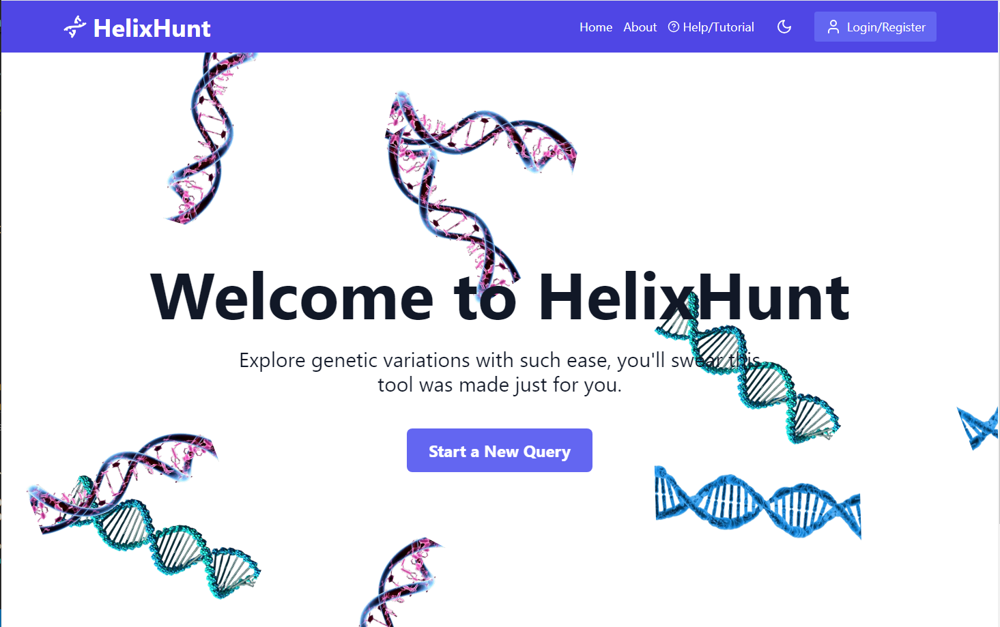
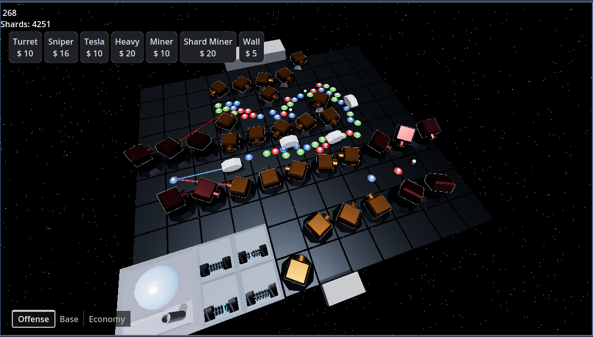
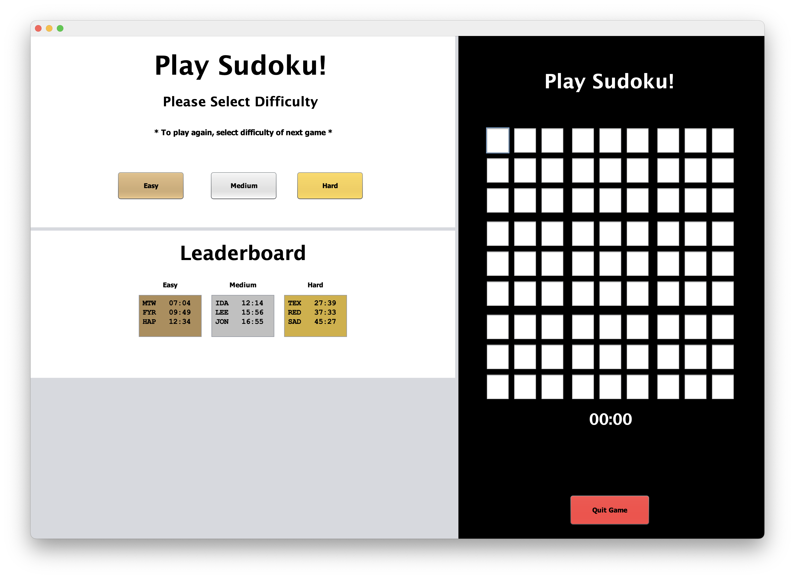
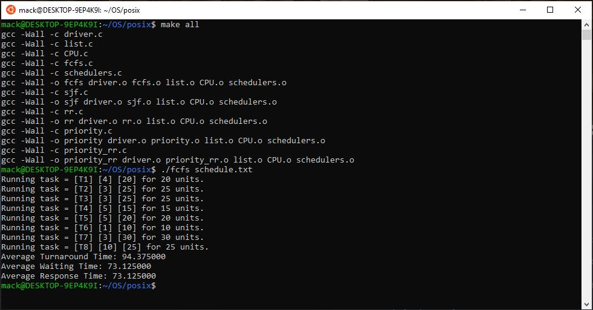

Portfolio
=========
I’m a software developer focused on building reliable, creative, and user-centered solutions. This portfolio highlights projects completed during my B.S. in Computer Science and beyond, showcasing work in systems programming, full-stack development, and game design. I bring experience with C, C++, Java, SQL, React, and Godot, and I’m eager to continue applying these skills in software engineering roles.

  
My Coding Journey

My journey began as a Computer Science student eager to understand how technology works at every level, from low-level systems to user-facing applications. Through coursework and personal projects, I developed strong skills in problem-solving, algorithm design, and collaborative development. Along the way, I explored languages like C++, Java, and C, while also branching into modern frameworks like React and game engines like Godot. As I continue to grow as a developer, I aim to deepen my expertise in both software engineering and systems programming, while taking on projects that challenge me to learn new tools and approaches.

 

**Languages:**  
C, C++, Java, Swift, Python, SQL, JavaScript, HTML, CSS, Ruby, PHP

**Frameworks:**  
React, Node.js, Ruby on Rails, Godot, MySQL, Oracle, AWS, Heroku, Linux

---

## Tools

**Operating Systems:**  
Windows, macOS, Linux

**IDEs and Source Control:**  
Visual Studio Code, Visual Studio, IntelliJ, Git, GitHub, Homebrew, LaTeX

--------------------

*For access to my private project repositories, please [email me](mailto:mackwessels@gmail.com?subject=GitHub%20Access) with the subject line, GitHub Access.

---
### [HelixHunt | CSCI 495](helixhunt_project.md)

---
### [Tower Defense Game | Personal Project](towerdefense_project.md)

---
### [Sudoku | CSCI 325](sudoku_project.md)

---
### [Scheduling Algorithms  | CSCI 431](scheduling_project.md)

---

Page template forked from <a href="https://github.com/csu-cs/csci-portfolio">CSU-CS</a>

<!-- Remove above link if you don't want to attributive -->
