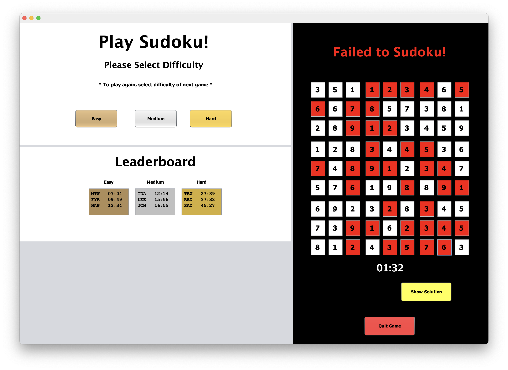
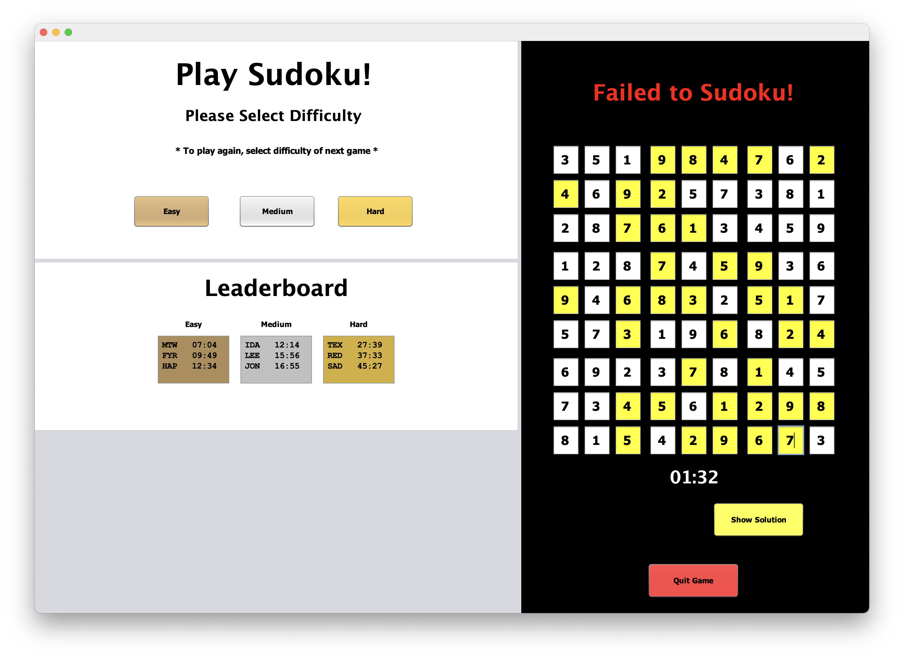
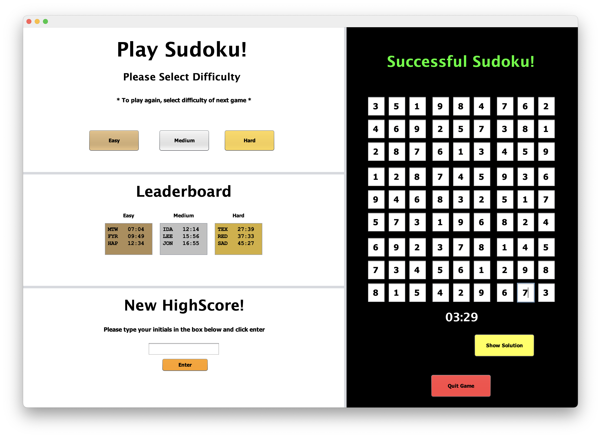

[Back to Portfolio](./)

Sudoku Game
===============

-   **Class:  Object Oriented Programming** 
-   **Grade: A** 
-   **Language(s): Java** 
-   **Source Code Repository:** (https://github.com/csu-cs/csci325-sudoku/tree/master/Sudoku)  
    (Please [email me](mailto:mwessels@csustudent.net?subject=GitHub%20Access) to request access.)

## Project description

This arcade style Sudoku game was built using Java. It contains three levels of difficulty: easy, medium, and hard. The player is tasked with completing puzzles within a certain time. If they succeed they will be prompted to enter their initials into the highscores leaderboard.

## How to compile and run the program

To get started, clone the repo:
Then open the folder in your desired Java IDE. Ensure that you have your desired JDK loaded in the project. Select the Main.Java file and press the “Run” button in the IDE.

## UI Design

Once the user has launched the program, they will be greeted by the Main GUI (see Fig 1). Click your desired difficulty, then gambeboard will be populated and the timer will start (see Fig 2). Click on or tab to each empty box to enter your solution.

  
Fig 1. The launch screen

  
Fig 2. Difficulty selected

Once you have finished your attempt, you can click the Check Solution button. If you have failed to solve the gameboard, you will be notified above the board. Each solution box that was incorrect will be highlighted for the player (see Fig 3). The player can then check the correct solution by clicking the Show Solution button (see Fig 4).

  
Fig 3. Failed to solve Sudoku board

  
Fig 4. Showing solution to the current board

If the player clicks the Show Solution button without entering any solutions into the gameboard, it will display the solved gameboard without any highlights (see Fig 5).

  
Fig 5. Showing solution without submitting attempt

If the player has made their entries and successfully solved the game, they will shown a banner above the gameboard (see Fig 6). If their successful attempt is fast enough, they will see the New High Score pane show in the bottome left of the GUI. The player can enter their initials and click the Enter button (See Fig 7).

  
Fig 6. Solved Sudoku board

  
Fig 7. New high score entry panel

Once the new high score has been recorded, it will be displayed in the leaderboard for that particular difficulty (see Fig 8).

  
Fig 8. Updated Sudoku high scores

## 3. Additional Considerations

More puzzles can be added to the desired “difficulties” file, inside the Sudoku Gameboards folder. Launch the game after adding more puzzles into the desired diffulty and they will be added into it’s selection pool.

[Back to Portfolio](./)
