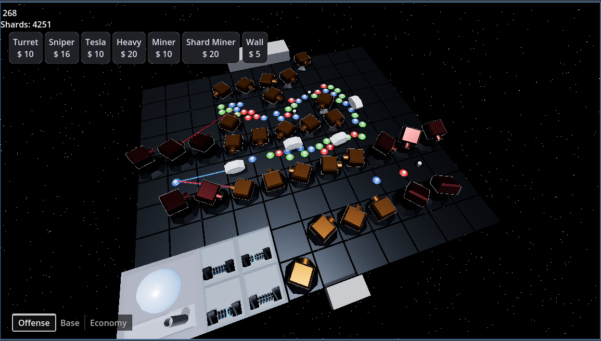

# Tower Defense Game | Personal Project

---

## Overview
This 3D tower defense game was developed in **Godot** using **GDScript** and custom assets modeled in **Blender**. The project explores real-time strategy mechanics, pathfinding, and resource management in a dynamic, procedurally generated environment. It’s my most ambitious and polished project, blending algorithmic problem-solving with game design.

---

## Features
- **Dynamic Pathfinding:** Enemies use a flow-field system that recalculates routes when players build walls or towers, ensuring adaptive gameplay.  
- **Unique Towers:** Includes Tesla (chain lightning), Sniper (long range), Mortar (area damage), and Miner/Shard Miner (resource generation).  
- **Resource Economy:**  
  - *Minerals* for in-run purchases and tower placement.  
  - *Shards* as a persistent meta-currency to unlock upgrades across playthroughs.  
- **Meta-Progression:** Persistent upgrades for towers and player health, integrated through a custom UI.  
- **Enemy Variety:** Features basic enemies, tanky types, and carrier enemies that deploy additional units mid-path.  
- **Procedural Maps:** Board and tile systems that generate varied layouts each run.  

---

## Tech Stack
- **Engine:** Godot 4.4.1  
- **Language:** GDScript  
- **3D Assets:** Blender (models, towers, enemies)  
- **Version Control:** Git + GitHub  
- **Other Tools:** LaTeX (design docs), VS Code  

---

## Challenges
- Designing a **flow-field pathfinding system** that adapts in real-time when tiles change.  
- Balancing tower mechanics and costs while ensuring fun, strategic gameplay.  
- Creating **custom shaders and materials** to give towers and tiles a distinctive visual identity.  
- Implementing **persistent meta-upgrades** using autoload scripts to store player progress.  

---

## Lessons Learned
- How to structure a larger Godot project with reusable components and autoloads.  
- The importance of balancing **technical problem-solving** (pathfinding, optimization) with **player experience** (clarity, pacing).  
- Experience integrating **3D modeling workflows** into a game engine pipeline.  
- Reinforced my ability to design systems that combine algorithms, game mechanics, and player-facing UI.  

---

For repository access, please [email me](mailto:mwessels@csustudent.net?subject=TowerDefense%20Repo%20Access).

